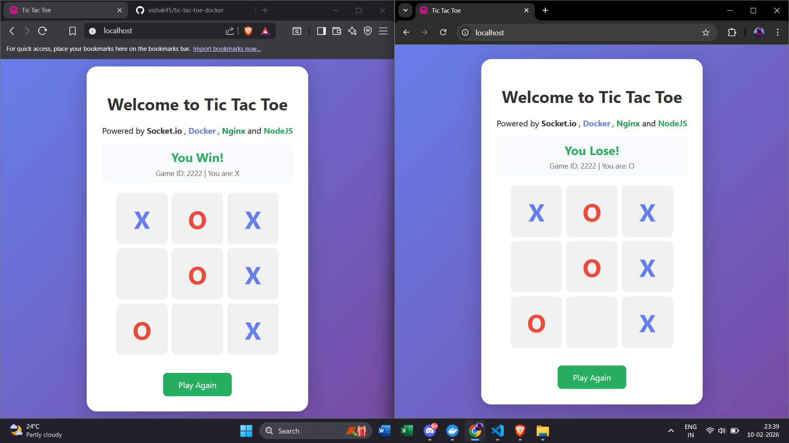

# Tic Tac Toe

A real-time multiplayer Tic Tac Toe game with Docker deployment, Nginx frontend, and Node.js backend using Socket.IO.

## Screenshot



## Architecture

```
┌─────────────────┐     ┌─────────────────┐
│     Nginx       │────▶│     Backend     │
│   (Port 80)     │     │   (Port 3000)   │
│  Static Files   │     │  Express + WS   │
└─────────────────┘     └─────────────────┘
```

## Features

- Real-time multiplayer gameplay via WebSockets
- Room-based game sessions using Game IDs
- Turn-based game logic with validation
- Win/draw detection
- Game restart functionality
- Automatic cleanup when players disconnect
- Docker containerized deployment
- Nginx reverse proxy for API requests

## Tech Stack

- **Nginx** - Static file serving & reverse proxy
- **Express** - Web server framework
- **Socket.IO** - Real-time bidirectional communication
- **Docker** - Containerization
- **Docker Compose** - Multi-container orchestration

## Project Structure

```
├── docker-compose.yml    # Multi-container orchestration
├── Dockerfile            # Nginx container
├── nginx.conf            # Nginx configuration
├── index.html            # Frontend (Tic Tac Toe UI)
└── backend/
    ├── index.js          # Express + Socket.IO server
    ├── package.json
    └── Docker/
        └── Dockerfile    # Backend container
```

## Quick Start with Docker

```bash
# Build and start all containers
docker compose up --build

# Run in detached mode
docker compose up -d --build

# Stop containers
docker compose down
```

The app will be available at:
- **Frontend**: http://localhost (port 80)
- **Backend API**: http://localhost:3000
- **API via Nginx proxy**: http://localhost/api/

## Local Development (Without Docker)

### Backend

```bash
cd backend
npm install
npm start
```

### Frontend

Open `index.html` directly in a browser or serve it with any static file server.

## Docker Configuration

### Services

| Service | Image | Port | Description |
|---------|-------|------|-------------|
| web | nginx:alpine | 80 | Serves frontend, proxies /api/ to backend |
| backend | node:20-alpine | 3000 | Express + Socket.IO server |

### Nginx Configuration

- Serves static files from `/usr/share/nginx/html`
- Proxies `/api/*` requests to the backend container
- Uses Docker network `test-networks` for inter-container communication

## Socket.IO Events

### Client → Server

| Event | Payload | Description |
|-------|---------|-------------|
| `joinGame` | `gameId: string` | Join or create a game room |
| `makeMove` | `{ position: number }` | Make a move (0-8) |
| `restartGame` | - | Restart the current game |

### Server → Client

| Event | Payload | Description |
|-------|---------|-------------|
| `gameJoined` | `{ gameId, playerSymbol, board, currentTurn, playersCount }` | Confirmation of joining |
| `playerJoined` | `{ playersCount }` | A player joined the room |
| `gameStart` | `{ board, currentTurn }` | Game starts (2 players ready) |
| `moveMade` | `{ board, currentTurn }` | A move was made |
| `gameOver` | `{ board, winner, isDraw }` | Game ended |
| `gameRestarted` | `{ board, currentTurn }` | Game was restarted |
| `playerLeft` | `{ playersCount }` | A player left the room |
| `error` | `message: string` | Error message |

## Game Rules

1. First player to join a game room is **X**
2. Second player is **O**
3. X always goes first
4. Players take turns placing their symbol
5. First to get 3 in a row (horizontal, vertical, or diagonal) wins
6. If all 9 cells are filled with no winner, it's a draw

## API Endpoints

| Method | Endpoint | Description |
|--------|----------|-------------|
| GET | `/` | Health check |
| GET | `/api/test` | Test endpoint |

## License

ISC
